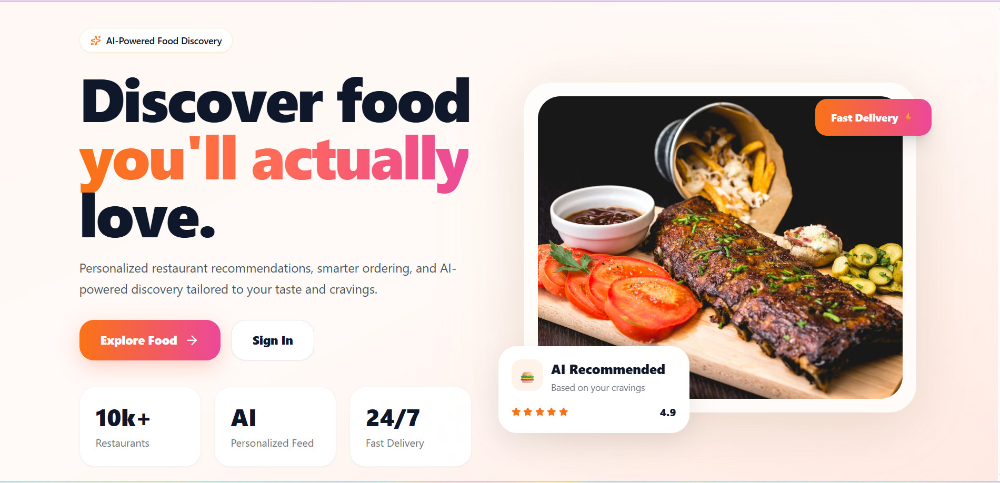
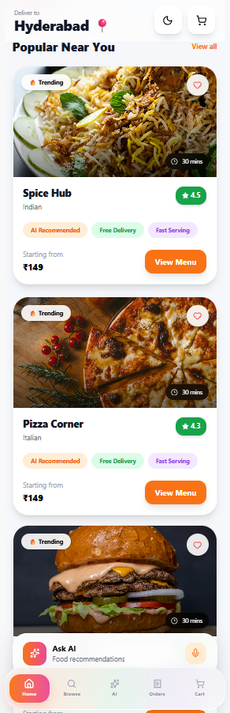
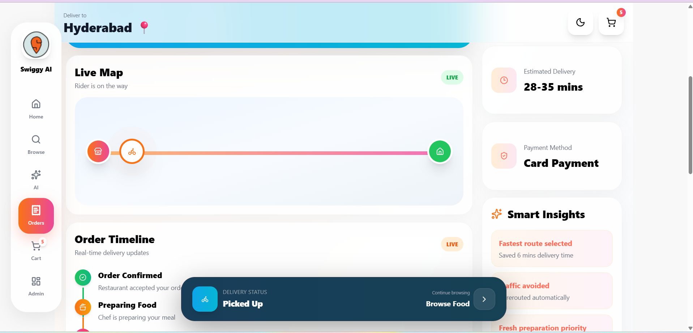

# 🍔 Swiggy Reimagined

### AI-Powered Food Delivery Experience

> A complete redesign of the Swiggy mobile ordering experience focused on reducing checkout friction, improving delivery confidence, and creating a smarter AI-assisted ordering flow.

---

## ✨ Highlights

- AI Smart Checkout
- Real-time Rider Tracking
- Interactive Live Delivery Map
- Advanced UPI Payment Flow
- Modern Mobile-first UX
- Premium Checkout Experience
- Smart Delivery Reassurance
- Smooth Microinteractions

---

## 🔗 Live Demo

### Frontend
[Open Live App](YOUR_VERCEL_LINK)

### GitHub
[Repository](https://github.com/Vaishnavidasyam/swiggy-ai-redesign)

---

# 📌 Table of Contents

1. [Problem Discovery](#1--problem-discovery)
2. [Feature Proposal — AI Smart Checkout](#2--feature-proposal--ai-smart-checkout)
3. [UX Flow + UI](#3--ux-flow--ui)
4. [AI Usage Breakdown](#4--ai-usage-breakdown)
5. [Tech Stack](#5--tech-stack)
6. [Screens Redesigned](#6--screens-redesigned)
7. [Product Evolution Opportunities](#7--product-evolution-opportunities)

---

# 1. 🚨 Problem Discovery

## What Pain Point Did I Identify?

Food delivery apps are fast — until checkout.

The moment a user taps **"Proceed to Pay"**, the experience breaks down:

- Multiple taps to select payment methods
- No smart payment suggestions
- Confusing bill hierarchy
- Anxiety after payment
- Poor post-payment reassurance
- No personalization during checkout

The checkout is where:
- trust is most fragile
- abandonment is most costly

yet it receives the least UX investment.

---

## Why Does It Matter?

Food delivery is a:
- high-frequency
- high-stress
- mobile-first behavior

Users order:
- during work
- late nights
- while multitasking
- while hungry

Even small UX friction causes:
- checkout abandonment
- payment distrust
- failed retries
- lower retention

---

## Who Faces This Problem?

### Primary Users

- Gen-Z students
- Office workers
- Frequent delivery users
- Mobile-first consumers

### Especially Affected

- UPI users
- Users on poor networks
- Group order customers
- Peak-hour delivery users

---

# 2. 💡 Feature Proposal — AI Smart Checkout

## What Is the Feature?

AI Smart Checkout is an intelligent checkout layer built directly into the Swiggy payment experience.

It improves:
- payment speed
- checkout confidence
- delivery reassurance
- real-time transparency

without changing the familiar ordering flow.

---

## 🔮 Smart Payment Prediction

AI analyzes:
- order history
- preferred payment habits
- order value
- payment success rate

to intelligently recommend the best payment option.

Example:

> “You usually pay with GPay for evening orders. Continue with GPay?”

---

## 🧾 Transparent Bill Confidence

Instead of hiding fees until the final step:

- taxes
- delivery fee
- surge pricing
- platform fee

are shown transparently from the cart stage itself.

This reduces:
- frustration
- surprise costs
- checkout distrust

---

## 💬 Post-Payment Reassurance Engine

After payment, users immediately see:

- order confirmation
- delivery ETA
- rider assignment updates
- live tracking
- calming status communication

instead of generic loading screens.

---

## Why Now?

- India crossed 650M+ UPI users
- Food delivery usage is increasing rapidly
- Existing checkout experiences still feel outdated
- AI personalization can now happen instantly

This creates an opportunity for:
- smarter UX
- calmer interactions
- faster conversions

---

## Why Would Users Care?

| Before | After |
|---|---|
| Multiple payment steps | One-tap AI-assisted checkout |
| Hidden fees | Transparent billing |
| Anxiety after payment | Calm confirmation flow |
| Generic UI | Personalized experience |
| Weak delivery updates | Live intelligent tracking |

The experience feels:
- faster
- smarter
- calmer
- more trustworthy

---

# 3. 🎨 UX Flow + UI

# Redesigned User Journey

```text
Browse Food → Add to Cart → Address Selection → AI Smart Checkout → Live Tracking
```

---

## 🏠 Browse & Add to Cart

### Improvements

- Cleaner food hierarchy
- Floating smart cart bar
- Live pricing updates
- Modern quantity controls
- Smoother microinteractions

### Edge Cases

- Restaurant closed
- Item unavailable
- Empty cart state

---

## 📍 Address Selection

### Improvements

- Live location support
- Saved address prioritization
- AI delivery hints
- Faster address selection

### Edge Cases

- Location denied
- Unserviceable areas
- First-time users

---

## 💳 AI Smart Checkout

### Features

- AI payment recommendations
- Cleaner bill hierarchy
- Modern UPI flow
- Premium payment cards
- Faster confirmation UX

### Payment Flow

```text
Select Payment
↓
Choose UPI App
↓
Redirecting Animation
↓
Order Confirmation
↓
Live Tracking
```

### Edge Cases

- UPI timeout
- Payment failure
- Network interruption
- Duplicate payment prevention

---

## 📦 Post-Payment Experience

### Order Confirmation

Users instantly see:
- amount paid
- ETA
- order confirmation
- rider preparation state

---

## 📍 Live Order Tracking

### Features

- Animated order tracker
- Expandable live rider map
- Rider movement simulation
- Dynamic ETA updates
- Delivery reassurance system

### Tracking States

1. Order Received
2. Preparing
3. Picked Up
4. Arriving
5. Delivered

---

# 4. 🤖 AI Usage Breakdown

## How AI Helped

AI was used as:
- UX research assistant
- product thinking collaborator
- interaction reviewer
- hierarchy optimizer
- microcopy assistant

---

## 🧠 Problem Discovery

AI helped identify:
- checkout anxiety
- payment distrust
- hidden-fee frustration
- post-payment uncertainty

---

## 📐 UX Strategy

AI helped:
- simplify flows
- reduce clutter
- prioritize important actions
- improve checkout hierarchy

---

## 🗣️ Microcopy

AI assisted in:
- reassurance messaging
- payment states
- tracking communication
- onboarding language

---

## 🔄 Edge Case Discovery

AI helped identify:
- payment failures
- rider delays
- restaurant cancellations
- retry experiences

---

## 🎨 UI Hierarchy Review

AI helped optimize:
- spacing
- information order
- CTA placement
- visual priority

---

# ✨ Key Highlights

- AI-powered Smart Checkout
- Real-time Order Tracking
- Interactive Rider Map
- Advanced UPI Payment Flow
- Smooth Microinteractions
- Mobile-first Responsive UI
- Swiggy-inspired modern UX

---

# 5. 🛠️ Tech Stack

## Frontend

| Tool | Purpose |
|---|---|
| React | UI Architecture |
| Tailwind CSS | Styling |
| Framer Motion | Animations |
| React Router | Navigation |

---

## Backend

| Tool | Purpose |
|---|---|
| Node.js | Runtime |
| Express.js | API Layer |
| MongoDB | Database |

---

## AI Layer

| Tool | Purpose |
|---|---|
| AI-assisted UX workflows | Product thinking |
| AI copy refinement | UX writing |
| AI hierarchy analysis | Layout optimization |

---

# 6. 📸 Screens Redesigned

| # | Screen | Improvement |
|---|---|---|
| 1 | Home Feed | Cleaner hierarchy |
| 2 | Restaurant Page | Faster menu scanning |
| 3 | Smart Cart | Floating cart summary |
| 4 | Address Selection | AI-assisted delivery hints |
| 5 | AI Checkout | One-tap smart payment |
| 6 | UPI Flow | Faster UPI experience |
| 7 | Payment Redirect | Calm loading states |
| 8 | Live Tracking | Animated rider tracking |
| 9 | Rider Map | Live movement simulation |
| 10 | Delivered State | Better delivery reassurance |

---

# 📸 Product Screens

## 🏠 Home Experience



---

## 🛒 Smart Cart



---

## 💳 AI Smart Checkout


---

## 📍 Live Order Tracking



---

# 7. 🚀 Product Evolution Opportunities

- Real-time GPS integration
- AI-based ETA prediction
- Voice food ordering
- Adaptive personalization
- Multi-device order sync
- Smart reorder suggestions
- Group ordering flows
- AI delivery optimization

---

# ⚙️ Run Locally

## Clone Repository

```bash
git clone https://github.com/Vaishnavidasyam/swiggy-ai-redesign.git
```

---

## Frontend Setup

```bash
cd client
npm install
npm run dev
```

---

## Backend Setup

```bash
cd server
npm install
npm start
```

---

# 🚀 Final Outcome

This project combines:
- product thinking
- UX redesign
- frontend engineering
- motion design
- AI-assisted workflows
- mobile-first interaction systems

to create a launch-ready next-generation food delivery experience.

---

Built with React, Tailwind CSS, Framer Motion, Node.js, Express, MongoDB, and AI-assisted UX workflows.
